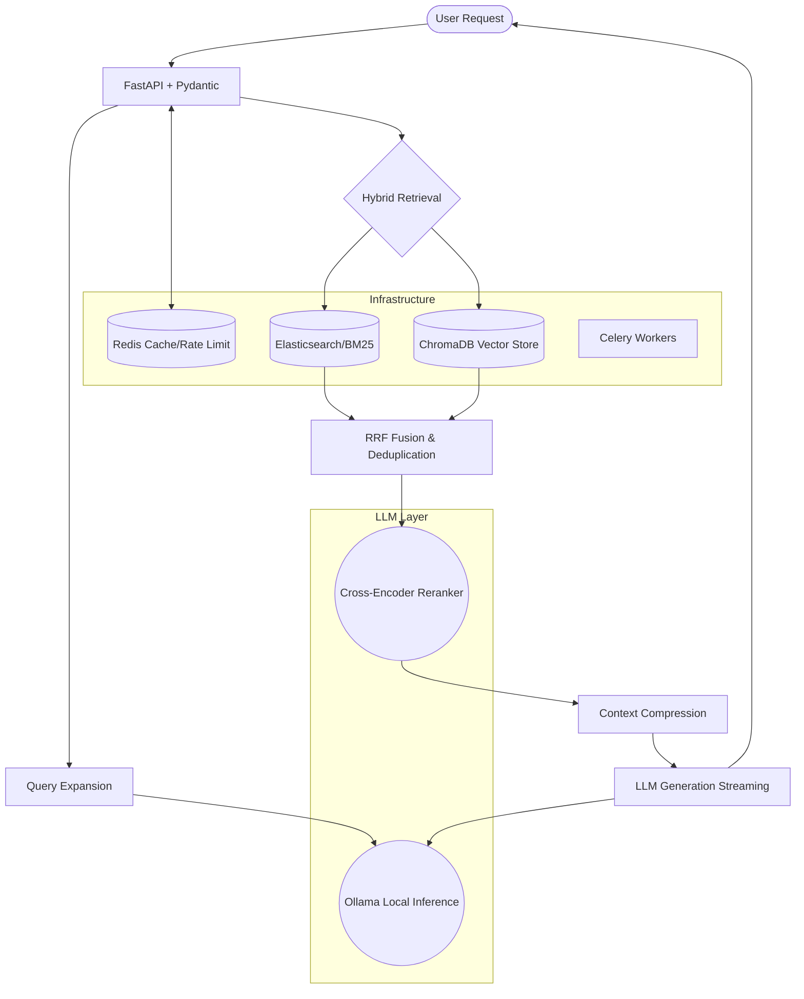

<h1 align="center">HGPT RAG System</h1>

<p align="center">
  <b>Enterprise-ready Retrieval-Augmented Generation (RAG) system engineered for high-throughput, fault-tolerant document reasoning at scale.</b>
</p>

<p align="center">
  <!-- TODO: Replace with your actual project screenshot or GIF -->
  
</p>

## 🛠️ Tech Stack

- **Core Backend:** Python 3.11+, FastAPI
- **LLM & Embeddings:** Ollama (Llama 3.1:8B, Nomic-embed-text)
- **Reranker:** Sentence Transformers (`ms-marco-MiniLM-L-6-v2`)
- **Databases & Caching:** ChromaDB (Vector DB), Redis (Caching/Rate Limiting), Elasticsearch/DistributedBM25 (Lexical Search)
- **Background Processing:** Celery
- **Observability:** Prometheus, Grafana, Jaeger
- **Infrastructure:** Docker, Docker Compose

---

## 🏛️ System Design



**Architecture Overview:**
The HGPT RAG System processes incoming queries through a heavily optimized pipeline designed for concurrent web-scale requests. Initially, requests hit a FastAPI endpoint guarded by Redis rate limiters, moving asynchronously through an LLM-powered query expansion phase that generates parallel search vectors. We enforce a hybrid retrieval strategy—combining precise keyword matching via BM25 with deep semantic retrieval via ChromaDB—fusing the results through Reciprocal Rank Fusion (RRF). To balance latency with precision, a ms-marco cross-encoder strictly reranks the top candidates, which are subsequently compressed to fit contextual bounds before streaming the final generated response via local Ollama inference. This architecture actively trades off raw end-to-end memory footprint for dramatically higher recall and system durability through the implementation of circuit breakers, persistent async task queues (Celery), and comprehensive observability stacks (Jaeger, Prometheus, Grafana).

---

## 🚀 Getting Started

### Prerequisites
- **OS:** Linux, MacOS, or Windows (WSL2 recommended)
- **Tools:** Docker and Docker Compose
- **Hardware:** 16GB+ RAM (32GB for large collections), 4+ CPU cores. GPU optional but recommended.

### Local Setup

**1. Clone the repository**
```bash
git clone https://github.com/your-org/production-rag.git
cd production-rag
```

**2. Configure the environment variables**
```bash
# Copy the example environment file
cp .env.example .env
```

**3. Pull required local models**
```bash
# Pull models for generation and embeddings via your running Ollama container
docker-compose exec ollama ollama pull llama3.1:8b
docker-compose exec ollama ollama pull nomic-embed-text
```

**4. Run the infrastructure cluster**
```bash
# Start all services (FastAPI, Redis, Chroma, Celery, Observability)
docker-compose up -d
```

**5. Verify the deployment**
```bash
# Verify the health endpoint to ensure all systems are communicating
curl http://localhost:8000/health
```

---

## 📚 Comprehensive Documentation

<details>
<summary><b>🔍 Detailed Walkthrough: What Happens Under the Hood</b></summary>

### Scenario 1: Uploading a Document
**User Action:** Upload `transformer_paper.pdf` (5MB, 50 pages)  
**Timeline (30-60 seconds total):**

| Time | Component | Action |
|---|---|---|
| 0s | FastAPI | Receives file, validates size (<50MB) and type (PDF) |
| 0.1s | Security | Sanitizes filename, creates temp file with 0600 permissions |
| 0.2s | Celery Task | Queues `process_document_task` with task_id |
| 2s | Worker | Dequeues task, loads PDF with PyMuPDF |
| 2-5s | Text Extraction | Extracts 50 pages → ~800 sentences |
| 5-10s | Semantic Chunking | Embeds each sentence (800 × 50ms = 40s, but parallelized to ~5s) |
| 10-12s | Boundary Detection | Finds 120 semantic breakpoints (similarity < 0.7) |
| 12-15s | Parent-Child Split | Creates 120 parents, 240 children |
| 15-20s | ChromaDB Upsert | Async batch insert 240 vectors (HNSW index build) |
| 20-25s | BM25 Index | Updates shards (DistributedBM25) or Elasticsearch bulk API |
| 25-30s | Cache Cleanup | Invalidates Redis pattern `emb:*` |
| 30s | Response | Returns `{"task_id": "...", "status": "complete", "chunks": 240}` |

**What Gets Stored:**
- **ChromaDB:** 240 vectors (768 dims each, float32) = ~737KB vector data + HNSW structure
- **Redis:** ~200 cached embeddings (from chunking) = ~15MB
- **BM25:** Inverted index + document statistics = ~5MB

### Scenario 2: Asking a Question
**User Query:** *"What are the limitations of transformer models?"*  
**Timeline (8-12 seconds total):**

| Time | Component | Action |
|---|---|---|
| 0s | FastAPI | Validates query (length 3-1000 chars, sanitizes HTML) |
| 0.1s | Rate Limit | Checks Redis: `rate_limit:user_123 < 60/min` |
| 0.2s | Query Expansion | Calls Ollama (5s timeout, circuit breaker) |
| 0.5s | LLM Response | Returns 3 variations:<br>- "What are computational limits of transformers?"<br>- "What are the practical challenges of attention mechanisms?" |
| 0.5-1s | Hybrid Search (Parallel) | **Semantic:** Embed query (50ms, cached), HNSW search (10ms) → 40 docs each<br>**BM25:** Tokenize (1ms), Score shards (5ms) → 40 docs each |
| 1.1s | RRF Fusion | Combines 6 result lists (k=60), deduplicates → 20 docs |
| 1.2-1.5s | Cross-Encoder | Loads model, scores 20 pairs (15ms each) = 300ms CPU / 50ms GPU |
| 1.5s | Context Building | Top 10 docs, truncates to token limit (`tiktoken`) |
| 1.5-8s | LLM Generation (Stream) | Ollama streams tokens (~30 tok/sec) → 200 tokens = 6.7s |
| 8s | Confidence Score | Computes weighted average: 0.79 |
| 8s | Response | JSON with answer, sources, confidence, metadata |

</details>

<details>
<summary><b>⚙️ Configuration Reference (.env)</b></summary>

```bash
# Application
APP_NAME=ProductionRAG
ENVIRONMENT=development
DEBUG=false

# API
API_HOST=0.0.0.0
API_PORT=8000
WORKERS=4   # Number of Uvicorn workers

# Security
SECRET_KEY=change-this-to-a-secure-random-key
ALLOWED_HOSTS=["*"]   # Restrict in production
RATE_LIMIT_PER_MINUTE=60   # Per-user rate limit

# LLM
OLLAMA_URL=http://localhost:11434
OLLAMA_LLM_MODEL=llama3.1:8b
OLLAMA_EMBEDDING_MODEL=nomic-embed-text

# Vector Store
CHROMADB_PATH=./data/chroma
COLLECTION_NAME=production_rag
# For Docker Compose:
CHROMADB_HOST=chromadb
CHROMADB_PORT=8000

# Retrieval
DEFAULT_N_RESULTS=20   # Docs retrieved before reranking
RERANK_TOP_K=10   # Docs passed to LLM

# BM25
BM25_K1=1.5   # BM25 term saturation parameter
BM25_B=0.75   # BM25 document length parameter
BM25_SHARD_SIZE=10000   # Docs per shard (DistributedBM25)
BM25_USE_ELASTICSEARCH=false   # Set to true + configure ES
ELASTICSEARCH_URL=http://elasticsearch:9200

# Chunking
CHUNK_SIZE=512   # Tokens per chunk
CHUNK_OVERLAP=50   # Token overlap between chunks
SEMANTIC_CHUNK_THRESHOLD=0.7   # Similarity breakpoint threshold

# Context Compression
ENABLE_CONTEXT_COMPRESSION=true
CONTEXT_COMPRESSION_RATIO=0.5   # Keep top 50% sentences
MAX_CONTEXT_LENGTH=8192   # LLM context window

# Redis
REDIS_URL=redis://localhost:6379
CACHE_TTL=3600   # Seconds
EMBEDDING_CACHE_SIZE=100000   # Max cached embeddings

# Background Processing
CELERY_BROKER_URL=redis://localhost:6379/0
CELERY_RESULT_BACKEND=redis://localhost:6379/0

# Observability
PROMETHEUS_PORT=9090
JAEGER_ENDPOINT=http://jaeger:14268/api/traces
ENABLE_METRICS=true
ENABLE_TRACING=true

# Multi-Modal
ENABLE_MULTI_MODAL=false   # Set true to enable table/image extraction
CLIP_MODEL=clip-ViT-B-32

# Graph RAG
ENABLE_GRAPH_RAG=false   # Set true to enable Neo4j
NEO4J_URI=bolt://neo4j:7687
NEO4J_USER=neo4j
NEO4J_PASSWORD=password
```
</details>

<details>
<summary><b>📊 Monitoring & Observability</b></summary>

**Metrics Available in Prometheus**
| Metric | Type | Description | Alert Threshold |
|---|---|---|---|
| rag_query_duration_seconds | Histogram | Full query latency | p95 > 15s |
| retrieval_documents | Histogram | Docs retrieved per query | > 50 or < 5 |
| ollama_errors_total | Counter | LLM errors by model | > 5% error rate |
| chroma_connection_failures_total | Counter | Vector DB failures | > 0 |
| generation_tokens_total | Counter | Tokens generated | (cost tracking) |
| hallucination_rate | Gauge | Detected hallucinations/min | > 0.05 |

**Grafana Dashboards**
Access: `http://localhost:3001` (admin/admin)
- **RAG Overview Dashboard:** Queries/sec, Avg/p95/p99 latency, Confidence distribution, Error rate pie chart
- **Retrieval Deep Dive:** Semantic vs BM25 contribution, Cache hit/miss ratio, Reranking score distribution, Top-K recall vs used
- **LLM Performance:** Token generation rate (tok/sec), Model load time, Queue depth, Per-model error breakdown

**Jaeger Tracing**
Access: `http://localhost:16686`
*How to trace a query:*
```bash
curl -X POST http://localhost:8000/query \
  -H "X-Trace-ID: debug-query-123" \
  -d '{"question": "test"}'
```
*View trace:* Search for `debug-query-123` in Jaeger UI.
</details>

<details>
<summary><b>🧪 Testing Suite</b></summary>

**Unit & Integration Tests**
```bash
# Run all unit tests
pytest tests/unit/ -v --cov=core --cov=services

# Test specific component
pytest tests/unit/test_bm25_retriever.py -v

# Test full pipeline (requires services running)
pytest tests/integration/ -v
```

**Load Testing with Locust**
```bash
docker-compose run --rm api locust -f tests/load_test.py --host=http://api:8000
# Open http://localhost:8089 to set Users/Spawn rate.
```
*Expected results (4-core, 16GB, GPU): RPS 8-12 queries/sec, p95 <12s.*

**Evaluation with RAGAS**
```bash
python -m evaluation.run_eval --dataset path/to/eval.jsonl
```
</details>

<details>
<summary><b>🚨 Troubleshooting Common Issues</b></summary>

**Issue 1: Ollama Model Not Found**
Error: `model 'llama3.1:8b' not found`
```bash
docker-compose exec ollama ollama pull llama3.1:8b
# Verify with: docker-compose exec ollama ollama list
```

**Issue 2: ChromaDB Out of Memory**
Error: `RuntimeError: std::bad_alloc`
*Solution:* Reduce HNSW parameters in `.env` (`CHROMADB_HNSW_EF_CONSTRUCTION=50`, `CHROMADB_HNSW_EF=10`) or increase Docker memory limit.

**Issue 3: Redis Connection Refused**
Error: `ConnectionError: Error 111 connecting to localhost:6379`
```bash
# Restart Redis
docker-compose restart redis
```

**Issue 4: Circuit Breaker Open**
Error: `CircuitBreakerError: Timeout`
*Solution:* Check Ollama health (`curl http://localhost:11434/api/tags`) and restart Ollama container if down.

**Issue 5: Poor Answer Quality**
*Symptom:* Low confidence (<0.6) or irrelevant sources.
*Solution:* Rebuild BM25 index and check `retrieval_documents` logs to ensure you are actually retrieving from the vector store.
</details>

<details>
<summary><b>🚀 Production Deployment & Scaling</b></summary>

**Docker Compose (Single Server)**
```bash
docker-compose -f docker-compose.yml -f docker-compose.prod.yml up -d
```
*Note: `docker-compose.prod.yml` includes resource limits, restart policies, and health checks.*

**Kubernetes (Multi-Server)**
```bash
kubectl create namespace rag-system
kubectl apply -f k8s/secrets.yaml
kubectl apply -f k8s/configmap.yaml
kubectl apply -f k8s/redis.yaml
kubectl apply -f k8s/chromadb.yaml
kubectl apply -f k8s/ollama.yaml
kubectl apply -f k8s/api.yaml
kubectl apply -f k8s/celery-worker.yaml

# Expose API via LoadBalancer
kubectl expose deployment rag-api --type=LoadBalancer --port=80 --target-port=8000 -n rag-system
```

**Horizontal Pod Autoscaler (HPA)**
Automatically scale when crossing CPU or RAM boundaries.
```bash
kubectl apply -f k8s/hpa.yaml
```
</details>

<details>
<summary><b>🔌 API Reference</b></summary>

**`POST /query`** - Ask a question to the RAG system.
```json
{
  "question": "What are the limitations of transformers?",
  "use_hybrid": true,
  "use_multi_query": true,
  "use_query_expansion": true
}
```

**`POST /documents/upload`** - Upload a PDF for processing.
```bash
curl -X POST http://localhost:8000/documents/upload \
  -H "Authorization: Bearer token" \
  -F "file=@paper.pdf"
```

**`GET /tasks/{task_id}`** - Check document processing status.
```json
{
  "task_id": "celery-task-uuid-123",
  "status": "SUCCESS",
  "result": {
    "chunks": 240,
    "documents_processed": 1
  }
}
```
</details>

---

## 🤝 Contributing
1. Fork the repository
2. Create feature branch: `git checkout -b feature/new-retriever`
3. Write tests: `pytest tests/ -v`
4. Run linting: `make lint && make fmt`
5. Submit PR: Include Jaeger trace and evaluation metrics

## 📄 License & Acknowledgments
- **License:** MIT License - see LICENSE file for details
- **Acknowledgments:** ChromaDB team, Ollama team, Sentence Transformers, RAGAS team.
